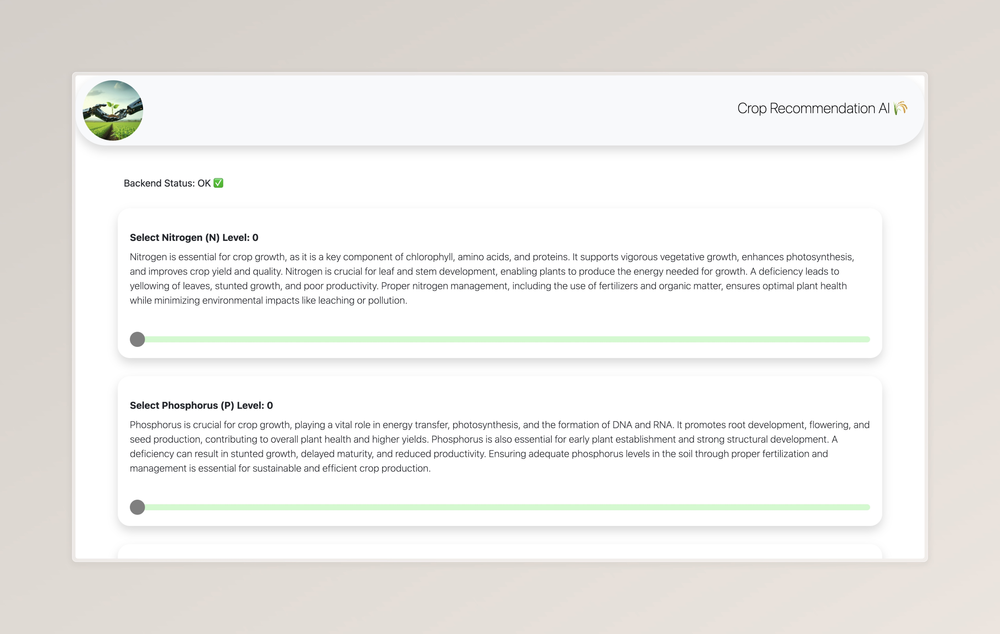
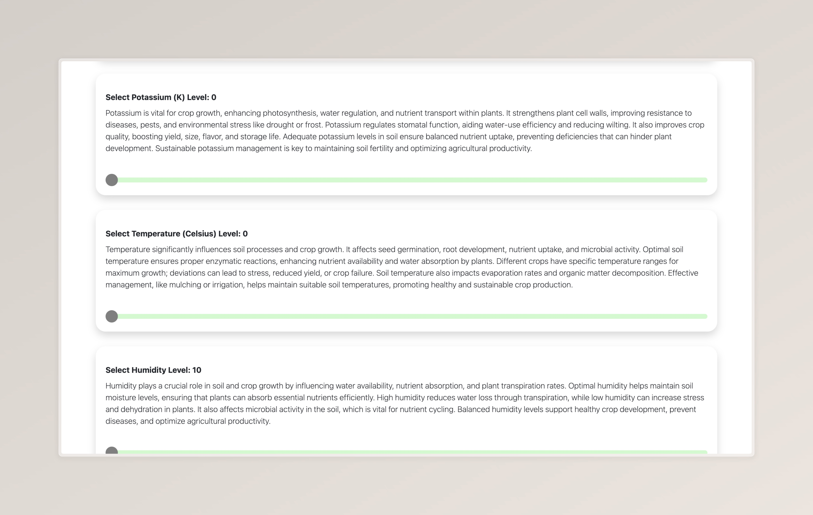
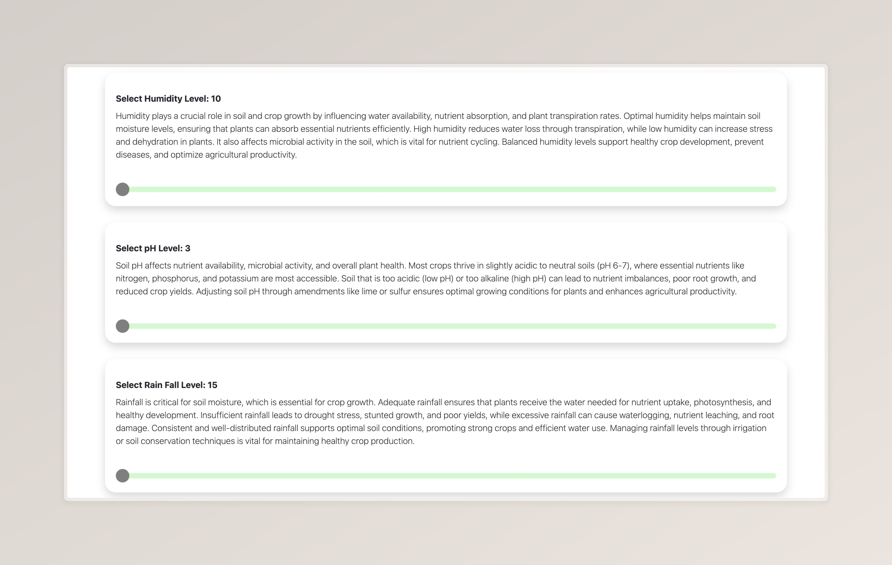
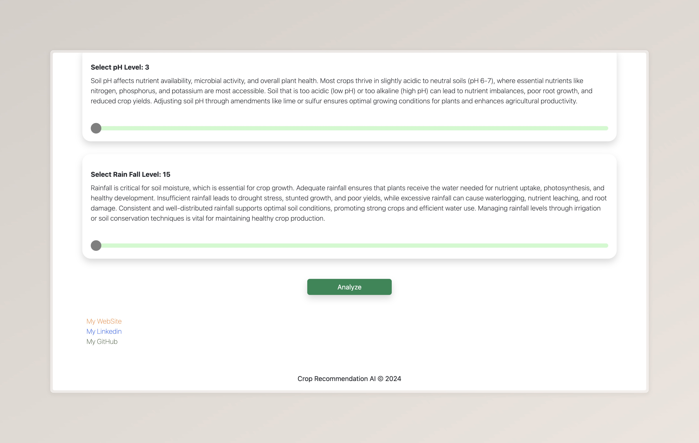
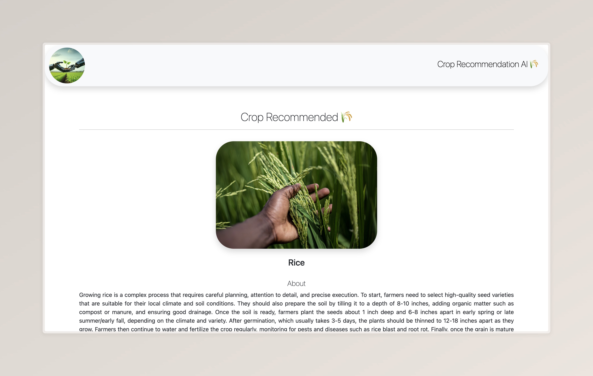
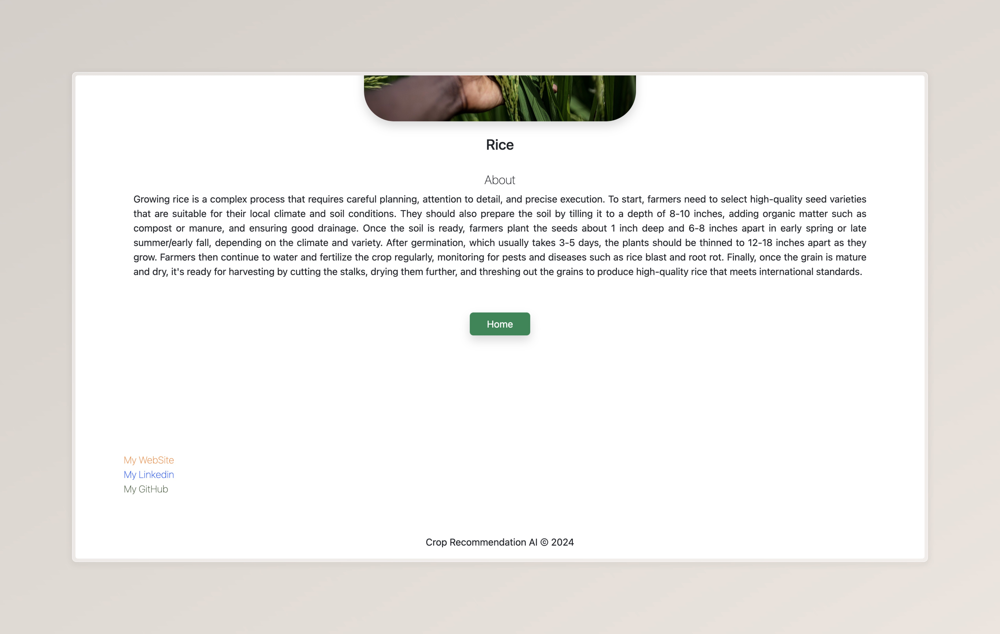
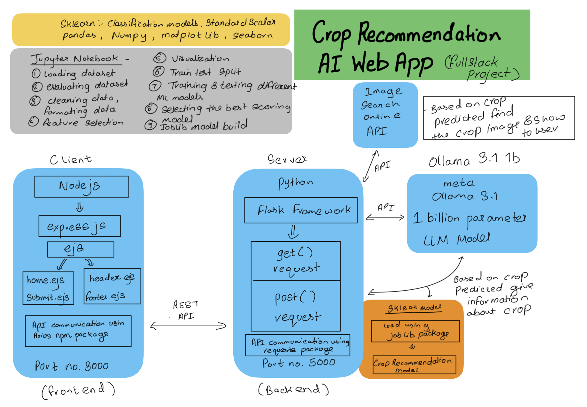

# 🌾 Crop Recommendation AI App
Project by [Sakib Dalal](https://github.com/Sakib-Dalal)


## Overview
The **Crop Recommendation AI App** is an intelligent web application designed to assist farmers and agricultural enthusiasts in selecting the most suitable crop for their land based on specific environmental and soil conditions. This app leverages machine learning, natural language processing, and image search technologies to provide insightful and actionable recommendations.

---

## Features

- **Dynamic Slider Inputs**:
  Users can input key parameters such as Nitrogen, Phosphorous, and Potassium levels, along with temperature, humidity, and rainfall levels, using an interactive slider-based interface.

- **AI-Powered Crop Analysis**:
  A machine learning model, trained using Python’s `sklearn` library on a Kaggle crop dataset, predicts the most suitable crop for the given conditions.

- **Crop Image Search**:
  The app fetches relevant crop images from the internet using the Pixabay API, providing users with a visual reference.

- **Expert Guidance via AI**:
  The Ollama 3.2 model (1-billion parameter NLP model) generates detailed information about the recommended crop, including how to grow and care for it.

---

## Screen Shots 









---

## How It Works
1. Navigate to the home page and adjust the sliders to match the soil and environmental conditions of your land.
2. Click the **Analyze** button.
3. The app:
   - Analyzes the input data using the trained ML model.
   - Predicts the best crop to grow.
   - Fetches a representative image of the crop using the Pixabay API.
   - Provides a comprehensive guide on the crop, written by the Ollama NLP model.


---

## Technology Stack

### Frontend:
- **Node.js**
- **HTML, CSS, JavaScript**
- **Express.js**
- **Axios** (for HTTP requests)

### Backend:
- **Python Flask**
- **Machine Learning**: Scikit-learn (model training and testing)
- **Natural Language Processing**: Ollama 3.2 (1-billion parameter model)
- **Image Search**: Pixabay API



---

## Dataset
The crop dataset was sourced from [Kaggle](https://www.kaggle.com/). It contains detailed information about various crops, including their optimal growing conditions.

---

## Training and Testing
The machine learning model was trained and tested using **Jupyter Lab**, providing an interactive environment for development and experimentation.

---

## Installation

1. Clone the repository:
   ```bash
   git clone https://github.com/Sakib-Dalal/Crop_Recommendation_AI_App
   ```
2. Install dependencies for the frontend:
   ```bash
   cd client
   npm install
   ```
3. Install dependencies for the backend:
   ```bash
   pip install -r requirements.txt
   ```
4. Set up API keys for Pixabay and Ollama in the `.env` file.
5. Install and Setup ollama from: https://ollama.com/library/llama3.2:1b
6. Start the backend server:
   ```bash
   python main.py
   ```
7. Start the frontend server:
   ```bash
   node index.js
   ```

## Contribution & Social
Feel free to contribute to the project 🤘.

Follow me on:
- [GitHub](https://github.com/Sakib-Dalal)
- [Linkedin](https://www.linkedin.com/in/sakib-dalal/)

My Site: https://my-site-jet-beta.vercel.app/#home

---
